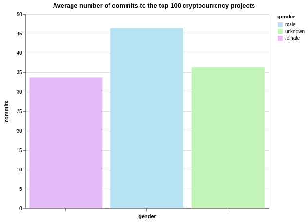

# Investigation: Less than 5% of Cryptocurrency Code Contributors are Female

***We looked at over 1 million code commits to assess the gender balance among contributors to the top cryptocurrency projects. The results show a pronounced shortage of female developers.***

## A systemic problem

After decades of gender imbalance, many fields of technology are starting to have a reckoning with the fact that they skew disproportionately male. Tech companies like Facebook, Twitter and Google now publish yearly diversity reports, which are [largely underwhelming](https://mashable.com/article/facebook-2018-diversity-report/). Emerging industries like artificial intelligence are in full blown [diversity crisis](http://fortune.com/2019/04/23/artificial-intelligence-diversity-crisis/) according to insider reports, resulting in biases built into products shipped. Yet although these statistics can be discouraging, highlighting such systemic problems is the starting point for making change.

In the blockchain industry, some data on diversity already exists. A 2018 [report from LongHash](https://www.longhash.com/news/blockchains-gender-divide-a-data-story) found that 14.5 percent of staff in blockchain startups were women across all staff positions, while analysis by Quartz found that 85 percent of blockchain companies launched between 2012-2018 had an all-male founding team. Another commonly cited statistic, Coin.Dance's [bitcoin engagement by gender summary](https://coin.dance/stats/gender), is based on Google Analytics data, and usually hovers between 5 and 10 percent female from week to week. 

But when it comes to the gender balance of developers working in the field there's little in the way of reliable data—especially considering that blockchain projects are not always formal companies, but can instead be organized as open source projects to which developers contribute code on an ad hoc basic.

In an attempt to investigate, we assembled a new dataset of contributions to the top 100 cryptocurrency projects—over 1 million code commits in total—and attempted to infer the gender of contributors who had associated real names with their user accounts. We hope the findings drive discussion of the current state of crypto, and how it could be improved.

## What we did

On April 3rd 2019, we used Messari's [OnChainFX dashboard](https://messari.io/onchainfx) to gather a list of the top 100 crypto projects by market cap, and compiled a spreadsheet linking each project to the GitHub account where all of the repositories of the project's code are hosted.

Projects were discarded if too many of the organization's repositories were unrelated to the core project—for example, Basic Attention Token is hosted on an account that also includes the codebase for Brave Browser. Whenever a project was discarded from the initial list of 100, a replacement was drawn from item 101 onwards on the OnChainFX list, maintaining the overall number.

Using the GitHub API and a [custom Python script](https://github.com/corintxt/crypto-gender-investigation/blob/master/get_collaborators.py), we queried each of the 100 organizations to obtain a list of every repository belonging to the organization, and then every developer who had made commits to the master branch of each repository, by username. Since many cryptocurrency projects start as forks of other projects e.g. Litecoin as a fork of Bitcoin, we used the `type=source`  parameter to omit forked repositories (without which, commits from a forked codebase would have been counted multiple times in the dataset).

We then queried each user account to find users who had filled in the `name` field with a real name, as shown below.

![]

*Response from an HTTP request querying the author's own GitHub account*

With a separate script, we queried each real name against a database maintained by [Genderize.io](https://genderize.io/), a web service that attempts to determine the gender of a first name. For each name, Genderize returns a predicted gender along with a probability estimate that the inferred gender is correct.

*Genderize API example*

We then merged the dataset of genderized names with the dataset of usernames and commits, creating a new dataset [INCLUDE DOWNLOAD LINK] of code commits with predicted gender grouped by organization, from which the conclusions in this article are drawn. 

Before examining the conclusions it should be noted that [gender is complicated](https://www.huffingtonpost.ca/2017/05/10/understanding-gender-identity_n_16542822.html): Having a name that is parsed as female does not equate to being a woman and vice versa. Increasingly the male/female binary is seen as a reductive way to examine gender, so these findings only give a rough proxy for the gender identity of blockchain developers.

## What we found

In total we scraped data on **1,026,804** code commits across 100 projects. Of these, **691,134** were made by developers with male-identified names, and only **47,678** were made by people with female-identified names. The remaining **287,992** commits were made by users who did not provide a real name, or (in a smaller number of cases) provided a name that could not be parsed as a given gender.

In total, GitHub users with female names account for **less than 5 percent** of the commits to the top 100 cryptocurrency priojects—**4.64 percent** to be exact.

GitHub users with male names make **67.3 percent** of the commits to the top 100 cryptocurrency projects, with the remaining **28.05 percent** made by developers of unknown gender.

There was also a discrepancy in the average number of commits made by each of the three groups. Male-named developers in the dataset made thirteen more commits to each project than female-named developers on average, and ten more commits than developers of unknown gender.

#### From commits to users

If we count the number of individual user accounts in the dataset rather than the number of commits the picture is similar, with **4.75** percent of the contributors having female-identified names. Using this metric, the main difference is in the number of developers whose gender could not be inferred—which rises to **37.9** percent.

In most cases these developers had simply not provided information for the `name` field of their GitHub profile; in a smaller number of cases, developers entered a name of ambiguous gender, or for which Genderize could not return a prediction.

**Contributors to the top 100 cryptocurrency projects:**

| male-named | female-named | unknown | total|
| ---- | ------ | ------- | ------- |
| 4974 | 412   | 3290 |8676|

## Individual projects

The discrepancy in gender balance was consistent across projects with a few outliers—although these were almost all attributable to misclassification by Genderize or a large numbers of contributors without listed real names, rather than high levels of participation from female developers.

By plotting the number of commits contributed by female-named developers against the number of commits by male-named developers on a chart, we can get a sense of how individual projects line up against one another. In the dataset as a whole, **54** projects incorporated fewer than 100 code commits from female-named developers, and **31** of these projects incorporated fewer than 10 code commits. Organizations in the lower right corner of the chart have a proportionally higher ratio of female:male code contributions, while those near the top left are particularly male dominated.

The charts also identify certain projects that appear to have more contributions from female-named developers than male-named developers, such as Bytom, VeChain, Neo and Theta Token. 

On closer inspection, data from these projects shows the weakness of the Genderize API, particularly with non-Western names. VeChain's lead blockchain developer [Bin Qian](https://analytics.hypernum.com/person/bin-qian) was incorrectly identified as a woman by Genderize; when this error is corrected, VeChain falls from the list. Similarly, Theta Token's CTO [Jieyi Long](https://www.linkedin.com/in/jieyilong/) was also misclassified as a woman.

Bytom web developer [Zhiting Lin](https://www.linkedin.com/in/zhitinglin/) was correctly identified as a woman, and made 940 commits to Bytom repositories overall. However, Bytom has an above average number of contributors with no listed real names, which may skews results.

## Conclusions

First, some caveats.

An open question is what we can assume about the gender of developers who choose not to enter a real name. Should we assume that the balance of men to women is 12:1, as in the gender-identified names, or might we speculate that in a male-dominated field, women are more likely to obscure their real name when contributing to a collaborative project?

On this question, data from existing studies suggest that the gender of developers in the 'unknown' category is likely to align with the gender split that we have already shown. 

In the largest study on the topic, conducted by GitHub through interviews with 5,500 open source developers, [95 percent of contributors to open source projects were found to be male](https://www.wired.com/2017/06/diversity-open-source-even-worse-tech-overall/)—a figure in keeping with the data presented here. In light of this, making comparisons between identifiably male or female names while ignoring contributions in the 'unknown' category is to introduce significant bias, though we should still keep in mind the potential margin of error.

Also, the dataset counts commits but not lines of code. Different developers and organizations commit code with varying frequency, so number of commits does not capture the full value of contributions to a project—and as a recent Motherboard article explained, even judging by pure lines of code [is a flawed method](https://www.vice.com/en_us/article/8xz9yk/the-sexist-trolls-doubting-black-hole-researcher-katie-bouman-need-to-learn-to-code).

Clearly then, the methodology used here can only give an approximate picture of the gender divide in cryptocurrency projects, and has many limitations. Undoubtedly the contributions of many women have been overlooked through their choice not to include a real name on their GitHub profiles, and due to time constraints it was not possible to check every entry for possible misclassification.

Still, though the data is fuzzy, it paints a clear picture of a field that is dominated by male developers across almost every major project. It's worth examining what the broader causes of such a gender imbalance are, and what steps the industry could take to encourage more women to take up blockchain programming. Research in other fields of business have suggested that [diversity provides a performance boost to companies](https://www.mckinsey.com/business-functions/organization/our-insights/why-diversity-matters), and we should be asking what potential benefits are being lost when the designers and developers pushing the industry forward come from a mostly homogeneous group.